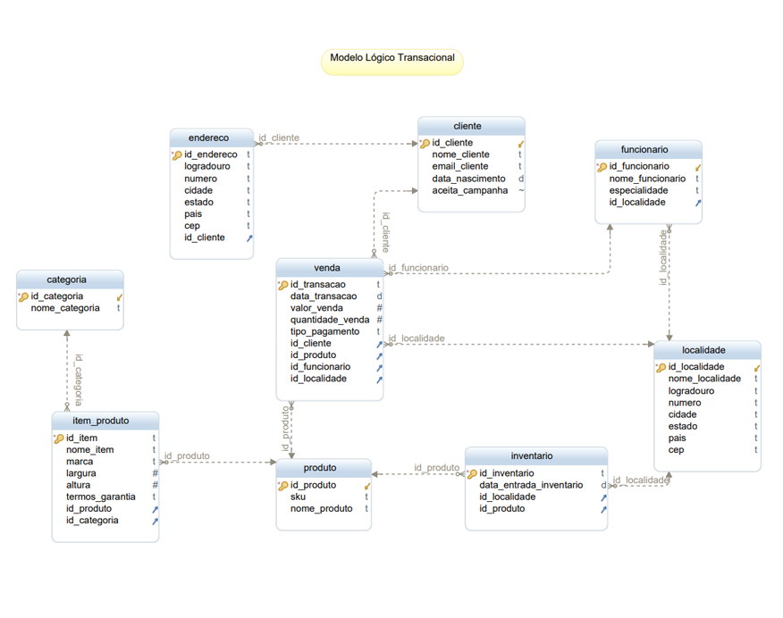

# Análise de Dados de Data Warehouse

## Sobre o Projeto
Data Warehouse é um repositório de dados que recebe informações do sistema transacional OLTP (Online Transaction Processing) e as transforma em dados analíticos, que podem ser utilizados para elaboração de relatórios com o auxílio de ferramentas de BI (Business Intelligence), tanto para fins informativos quanto analíticos.

## Motivação
O projeto a seguir tem como objetivo simular uma condição típica de um analista de dados, em que é necessário conectar-se ao Data Warehouse do cliente e extrair dados para gerar um relatório. Além disso, por ser um projeto de portfólio, busca trazer conhecimento não apenas nas análises, mas também na arquitetura básica desse tipo de repositório.

## Etapas
O projeto foi divididos em etapas afim de facilitar a dinâmica da sua construção, como pode se ver a seguir:
<ol>
  <li>Entendendo a necessidade do cliente</li>
  <li>Elaboração do modelo dimensional</li>
  <li>Elaboração do modelo físico</li>
  <li>Exportação dos dados</li>
  <li>Desenvolvimento do relatório</li>
</ol>

## 1. Entendendo a necessidade do cliente
A **TechZone**. com sede em Guarulhos-SP, é uma empresa Brasileira que atua no segmento de venda de eletrônicos direto ao consumidor. A empresa possui diversas lojas em todo estado de São Paulo, além de Rio de Janeiro, Minas Gerais, Pernambuco, Bahia, Goiás e Santa Catarina. Em seu sétimo ano de operação, a empresa tem conseguido manter boas margens de lucro, com um crescimento anual de faturamento na ordem de 6,7%. O CEO decidiu que é hora de expandir as operações e precisa compreender melhor o cenário atual da empresa.

Depois de extensa pesquisa, o CEO e o board de diretores decidiram que uma 
solução de Business Intelligence, com métricas e KPIs referentes ao negócio da 
empresa seriam úteis para compreender erros/acertos na gestão até aqui e ajudar 
na definição da estratégia de crescimento para os próximos anos. Foi criado então 
o projeto **DATAWISE**, com o objetivo de fornecer uma solução de Business Intelligence 
corporativa. A área de TI da companhia já possui licenças do Power BI para geração 
de relatórios. As licenças nunca haviam sido usadas e os diretores determinaram 
que o software fosse usado, como forma de reduzir custo, uma vez que o pacote já 
havia sido pago. Entretanto a empresa não possui experiência em análise de dados
e contrataram você para oferecer a consultoria necessária na construção da 
solução. Você será responsável pela criação do Data Warehouse, das interfaces ETL
e da construção do projeto de análise de dados no Power BI. A administração e 
suporte de primeiro nível será de responsabilidade da equipe de TI da empresa.

Em sua primeira reunião, diversos diretores explicaram em linhas gerais 
como funciona a operação da empresa e registraram isso em ata. Abaixo o 
resultado desta reunião.

A TechZone é uma empresa que vende eletrônicos, especialmente equipamentos de informática em geral. A empresa trabalha com margens agressivas e, embora o investimento em Marketing seja pequeno, ele é constante. São diversas lojas em todo Brasil e aproximadamente 750 funcionários.

Cada loja possui um estoque de diversos produtos eletrônicos, tais como 
desktops, notebooks, tablets e smartphones, que são os principais produtos da 
empresa, mas diversos outros produtos são vendidos, como TVs, sistemas de som, 
periféricos, entre outros. São aproximadamente 250 produtos, distribuídos em 15 
categorias. Um armazém situado em Barueri-SP, mantém os produtos que chegam 
via importação ou de fábricas em São Paulo e Minas Gerais, onde eles são 
catalogados, recebem um selo RFID e então são despachados para as lojas em todo 
Brasil. Cada produto possui um código SKU único, além de detalhes que são 
armazenados no sistema de cadastro de produtos, tais como nome do produto, 
marca, dimensões e outras especificações técnicas.

Sempre que uma venda é registrada em um ponto de venda, uma das 23 
lojas em todo Brasil, os vendedores são orientados a criar um cadastro sobre o 
cliente e solicitar uma autorização para o cliente receber futuras promoções e 
campanhas de Marketing. Nome, telefone, endereço e e-mail são obrigatórios no 
cadastro, mas outras informações podem ser solicitadas, principalmente no caso 
de vendas a prazo, como emprego atual, renda, tempo de residência e número de 
filhos.

A empresa possui também um cadastro de cada loja, que hoje está em 
planilha Excel. Lá estão o nome de cada loja (uma espécie de apelido que ajuda a 
identificar cada loja), o endereço, a região, cidade e estado. Cada loja tem um 
código. Essa planilha atualiza periodicamente o sistema de vendas da empresa, já 
que cada venda registrada é associada a uma loja. Todas as lojas vendem todos os 
produtos, mas as lojas mantêm estoques diferentes, como forma de reduzir custos 
com logística, ou seja, não despachar muitos produtos para as lojas que possuem 
um volume menor de vendas, o que poderia requerer possível movimentação 
posterior dos produtos para lojas com volume maior. Cada loja possui um CEP 
cadastrado cuidadosamente, pois a empresa implementa frequentemente
algoritmos de otimização de logística usando análise em grafos. Eles compararam 
um novo sistema recentemente, depois que ouviram dizer que o sistema, que é 
baseado em Inteligência Artificial, poderia reduzir em até 25% os custos de 
combustível otimizando as rotas dos caminhões de entrega!

Em cada loja, os funcionários atendem os clientes no showroom, onde os 
produtos são expostos e também no telefone. Cada loja conta com alguns 
vendedores, pessoal de limpeza e supervisor, trabalhando em 2 turnos. A empresa 
pretende começar a vender online, mas ainda não há previsão. Todos os 
funcionários são cadastrados no sistema interno da empresa, com número de 
matrícula, dados pessoais e especialidade. Uma venda é sempre feita por um 
vendedor, pois a empresa paga comissão pelas vendas efetuadas e a matrícula do 
responsável pela venda fica atrelada a cada venda realizada.

O valor e a quantidade de cada venda estão presentes nos relatórios diários 
da empresa, que são usados para diferentes decisões durante a semana. Mas esses 
relatórios são manuais, criados normalmente no Excel, e frequentemente 
apresentam erros. Cada diretor regional precisa saber as vendas por região, para 
acompanhar o desempenho da sua loja e comparar com as demais regiões por meio de um dashboard com alguns indicadores importantes para a métrica do negócio. A 
empresa faz muitas vendas de produtos como um único pacote ou combo, mas que 
são produtos diferentes. Por exemplo: um desktop pode ser vendido junto com um 
monitor, teclado e mouse. Embora seja um pacote, os produtos possuem SKUs 
diferentes, valores diferentes e contribuem de forma diferente quando um 
desconto é concedido. A empresa calcula o percentual de cada produto em uma 
venda de pacotes ou combos.

Os diretores acreditam que algumas categorias de produtos podem não ser 
lucrativas e gostariam de confirmar esta informação com o novo sistema de BI. Essa 
informação também será útil para definir as estratégias de expansão e quais novas 
categorias de produtos devem ser consideradas.

## 2. Elaboração do modelo lógico dimensional
O primeiro passo para construir o modelo lógico dimensional é entender o modelo lógico transacional que já está em vigor. Em linhas gerais esse modelo pode ser definido pelo seguinter schema:

O segundo passo é definir o sistema de gerenciamento de banco de dados (SGBD) para o modelo dimensional. Como não há nenhuma restrição, utilizei o MySQL.  

Uma vez decidido o SGBD, passamos ao terceiro passo, que consistiu na criação de um usuário para ter acesso ao sistema de modelagem. O script pode ser encontrado [clicando aqui](01%20-%20Usu%C3%A1rio/User.sql).  

*OBS: Como sou a única pessoa que possui acesso ao Data Warehouse, criei um usuário com privilégios de root*.  

No quarto, e último passo, utilizei o [**DB Schema**](https://dbschema.com) para conectar ao usuário e ao MySQL e criar o seguinte diagrama do modelo logico dimensional:

## 3. Criação do modelo físico
O código gerado pela criação dos schemas pode ser visualizado  [clicando aqui](02%20-%20Schema%20Modelo%20F%C3%ADsico/Modelo%20F%C3%ADsico.sql).  

**Explicando um pouco:**
<ol>
  <li>sk_cliente, sk_localidade, sk_produto e sk_data são chaves primárias que se incrementam automaticamente;</li>
  <li>Foi adicionado uma restrição na tabela fvendas por meio de uma chave primária onde não é possível ter uma mesma transação de um cliente, com um mesmo produto, em uma mesma localidade e em uma mesma data; </li>
  <li>Foram adicionadas restrições por meio de chaves estrageiras na tabela fvendas relacionadas com as tabelas dimensões, onde o update ou a deleção de valores dessas tabelas irão atualizar ou deletar os valores da tabela fato;
  </li>
</ol>

## 4. Exportação dos dados
Com o DW criado chegou a hora de fazer a exportação dos dados, a seguir é possível ter acesso a massa de dados exportados por meio do MySQL [clicando aqui](03%20-%20Carga%20de%20Dados).

